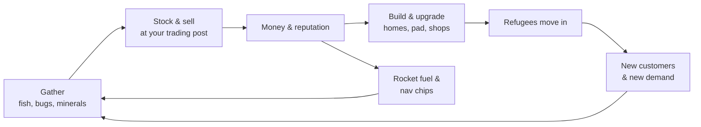
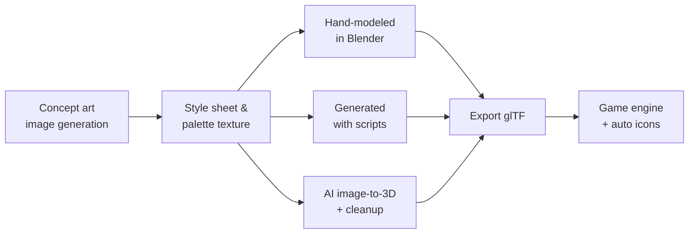

# Pocket Orbit: Little Haven — Game Plan

Last synced: Sep 24, 2026 · Owner: Zach
Living version: [Pocket Orbit — Game Plan](https://claude.ai/code/artifact/c1381a1f-8b41-4b74-b590-de44230e1378)
Concept art: [`images art direction/`](images%20art%20direction/) and [`images ui direction/`](images%20ui%20direction/)

## Pitch & pillars

**Run a little trading post on a small planet you're turning into a haven for refugees from the Galactic Confederation.** It's a cozy low-poly life sim on a planet you can walk all the way around, with a rocket to the rest of the solar system. The game is called *Pocket Orbit: Little Haven*, and the currency is **Stardust**.

**Premise.** You slipped out of the Confederation on forged papers and landed on a quiet planet at the edge of the system. A smuggler named Vessa set you up with a market stall and a debt. Over time other refugees drift in: new neighbors, new customers, new trouble with the Confederation auditor.

**Pillars**

1. **You're the shopkeeper.** Everything you gather (fish, bugs, minerals, starfall) is stock for your shop, not just something to donate or dump.
2. **A sanctuary that grows.** Refugees move in when your planet can support them. Every villager is someone you took in.
3. **A small world that feels alive.** A real sphere with an atmosphere, weather that drifts across it, day and night you can walk between, tides, and a view from orbit of the village you built.

**What sets it apart from Animal Crossing:** the player runs the store instead of shopping at one; villagers arrive because of what you build, not at random; the planet's climate slowly responds to what you do; and there's a real solar system to fly to.

## Core loops

Three loops feed each other: gathering stocks the shop, the shop pays for building, and building brings in refugees who become new customers and new demand.



The rocket branch lets you gather from other planets. Rare items there sell for more back home.

**Daily loop (15–30 min).** Check the landing pad for drone deliveries. Read today's demand board (what customers want). Gather around the planet, restock and reprice shelves, open the shop, talk to villagers, pay a bit of debt.

**Weekly loop.** A trader ship visits with special requests. Seasonal items rotate. The auditor might drop by. A meteor shower or storm front sometimes brings rare stock.

**Long arc.** Stall → shop → trading post. Pay off Vessa. Grow from 0 to about 10 villagers. Unlock the rocket, then each planet. Fill the Archive (the museum).

## Trading post system

The shop is the heart of the game: you decide what to stock, where to display it, and what to charge. Customers react to all three. Keep it cozy: no bankruptcy, no losing stock, just better or worse days.

### Risk grows as you progress

The early game is fully gentle. Risk arrives slowly with each shop tier, and it's always optional: you can ignore it and keep a calm shop.

| Stage | New risk | What you can lose |
| --- | --- | --- |
| Market stall | None | Nothing |
| General shop | Fresh goods: fish and flowers lose value after a few days unless kept in a tank or cooler | Some value on old stock |
| Trading post | Timed ship orders with bonus pay | Reputation with that trader if you miss the deadline, never money |
| Trading post | Vessa's contraband sells for a lot, but the auditor can confiscate it | The confiscated items |
| Orbital exchange | Bulk buying at Halo Market, where prices move up and down | Money, if you sell at a bad time |
| Orbital exchange | Cargo runs through The Scatter pay extra | Part of the cargo, sometimes |

A "relaxed shop" setting turns off every row after the first two for players who only want cozy.

### Shop tiers

| Tier | Unlocks at | Shelf slots | New features |
| --- | --- | --- | --- |
| 1. Market stall | Start | 4 | Set prices, basic demand board |
| 2. General shop | First debt payment | 12 | Indoor displays, decor, opening hours |
| 3. Trading post | 5 villagers + landing pad | 24 + cargo bay | Ship traffic, bulk orders, a hired helper |
| 4. Orbital exchange (late game) | Rocket tier 3 | Cargo only | Sell to other planets remotely |

### How selling works

- **Base value** per item comes from rarity, size, and season.
- **Demand** changes daily per item category and per customer species. A demand board in the shop shows 3–4 hints like "Mossbacks are craving cold things."
- **Your price** is set with a simple slider, from "bargain" to "premium." Overpriced items sell slowly and lower your reputation a little. Underpriced ones sell fast and raise it.
- **Displays matter.** A lit display case or a themed shelf (all ocean items together) adds a sale bonus. This turns decorating into strategy.
- **Reputation** unlocks customers, ship visits, and villager move-in requests.

### Who buys

- **Villagers:** daily walk-in customers. Each species has likes and dislikes.
- **Passing ships:** show up once you have a landing pad. They bring bulk requests ("20 ice crystals by Friday") with good payouts.
- **Special visitors:** a collector who pays triple for one specific item, a Confederation official who only buys "approved" goods.

### Other shops in town

- **Village shops** open when certain villagers move in: a tailor, a furniture maker, a nav-chip dealer, a fuel depot. You buy from them and they sometimes buy from you.
- **Vessa's back room:** banned goods and furniture from erased cultures. It's tied to your debt and to the auditor.
- **Drone mail-order:** a catalog of items you've owned before. Deliveries land on the pad the next morning.

### Price differences between planets

Each planet has a few goods it wants and a few it has plenty of. Ice is cheap at the poles and valuable on the volcanic world. Keep this light, a bonus for paying attention and never a spreadsheet game.

## World & tech

The home planet is a real sphere tiled with hexagons, small enough to walk all the way around in about 3.5 minutes.

### The planet

- **Hex grid:** about 2,500 hexagon tiles plus 12 pentagons (the math of a sphere forces exactly 12). The pentagons are ancient shrines and fast-travel points.
- **Gravity:** "up" is always the direction from the planet's center to the player.
- **Camera:** third person, low angle, so the horizon curves like in Wild World. It follows the player's own orientation and never locks to north, so it doesn't spin out at the poles.
- **Pathfinding:** custom, on the hex tiles. The engine's built-in navigation assumes flat ground.
- **Water:** a second sphere at sea level for oceans, and rivers carved into the terrain.

### Biomes

| Biome | Where | Signature features |
| --- | --- | --- |
| Polar ice | Above ~70° latitude | Ice spires, aurora, ice fishing |
| Tundra / pine | 50–70° | Pines, moss, cold-weather bugs |
| Temperate grassland | 20–50° | Village hub, meadows, rivers |
| Desert | 0–20°, dry areas | Dunes, cacti, glass, fossils |
| Jungle / marsh | 0–20°, wet areas | Big leaves, frogs, rare bugs |
| Mountains | High ground anywhere | Snowy peaks, minerals |

Latitude sets temperature, altitude cools things down, and a moisture map decides desert versus jungle.

### Terraforming

Biomes aren't fixed. Every tile has a ground type, and biomes slowly spread based on what you do.

- **Direct changes:** dig up grass and lay sand, pour water to make ponds, spread snow, plant moss.
- **Spreading:** a tile surrounded mostly by one ground type slowly converts to match it, checked once a day. Lay enough sand and a desert grows. Plant a grove and the forest creeps outward.
- **Moisture:** trees and water raise moisture nearby, and deserts dry it out. This decides what grows next.
- **Limits from latitude:** you can shrink the ice caps or green the desert edge, but you can't make a jungle at the pole. Cold sand at high latitude becomes tundra, not desert.
- **Payoff:** each biome has its own fish, bugs, and plants. Changing your land changes what you can catch and sell, and some villagers need a specific biome near their home to move in.
- **Gentle:** changes take days, can always be reversed, and nothing you've placed is ever destroyed.

### Sky and time

- **Atmosphere:** a thin shell with a glowing edge. Blue on the day side, orange and pink along the line between day and night.
- **Clouds:** low-poly cloud clusters on a slowly rotating layer. They cast moving shadows, and weather fronts drift across the planet.
- **Day and night:** your village's local time matches your real clock. Walk far enough east or west and you reach night or morning.
- **Seasons:** from axial tilt. North and south have opposite seasons.
- **Tides:** a moon causes low and high tide. Low tide reveals tide pools.
- **From orbit:** village lights glow on the night side.

### Space travel

| Destination | Type | What you do there |
| --- | --- | --- |
| Home planet | Hub | Everything |
| Tidewell | Ocean moon | Deep-sea fishing, pearls |
| Cinder | Volcanic world | Minerals, fossils, hot springs |
| Halo Market | Ringed planet | Big trade hub, buy rare goods |
| The Scatter | Asteroid belt | Scavenge wrecks and meteorites |
| Uncharted worlds | Procedurally generated | One-off trips for rare stock, like mystery island tours |

Fuel and nav chips limit how often you travel. The rocket can be upgraded and decorated.

## Art direction

Low-poly with flat, soft shading, where the atmosphere, clouds, and lighting do most of the visual work. Animation runs at full frame rate.

### Rules every asset follows

- **One shared palette texture.** Every model is colored by pointing its faces at swatches on a single small color image (for example 256×256 with about 64 swatches). One material covers the whole game, the colors always match, and changing the palette recolors everything.
- **Flat or lightly smoothed shading.** Visible facets on rocks and terrain, smoother on characters and cloth.
- **Chunky proportions.** Slightly oversized heads, hands, and tools. Rounded silhouettes. No thin details that disappear at a distance.
- **Readable shapes.** You should recognize every object from its outline alone, since the camera is pulled back.
- **Scale for the curve.** The planet is small, so tall objects (trees, buildings) exaggerate the curvature nicely. Keep buildings under about 3 player heights.

### Triangle budgets

| Asset type | Triangles |
| --- | --- |
| Small props, items, fish, bugs | 50–300 |
| Plants, rocks, furniture | 150–600 |
| Trees | 300–900 |
| Buildings | 600–2,500 |
| Characters | 1,000–2,500 |
| Rocket, ships | 1,000–3,000 |

### Lighting and mood

- Warm sun, cool blue shadows, soft ambient fill from the sky color.
- A subtle outline or edge highlight on characters so they stand out from the ground.
- Light fog and bloom on the atmosphere edge, streetlamps, and shop windows.
- Color mood by biome: pastel meadows, bleached sand, icy cyan and violet at the poles, deep green jungle.

## Low-poly asset list

Phase 1 needs about 140 models, but most fish, bugs, flowers, and rocks are color swaps of a few base shapes, so the real modeling work is closer to 50. The full game needs roughly 400. Phase numbers match the roadmap below.

### Characters

| Asset | Count | Phase | Notes |
| --- | --- | --- | --- |
| Player (modular body, heads, hair, outfits) | 1 base + 10 parts | 1 | Swappable parts on one skeleton |
| Refugee species base meshes | 3 (6 later) | 2 | e.g. Mossback (turtle-like), Glim (moth-like), Burrl (round, furry) |
| Villager variations | 2–3 per species | 2 | Color, accessories, markings |
| Vessa the smuggler | 1 | 1 | Runs the stall at first, then the back room |
| The auditor | 1 | 2 | Stiff, uniformed, carries a clipboard drone |
| Passing traders | 3 | 3 | One per visiting ship type |
| Animation set | ~15 clips | 1 | Walk, run, idle, cast, reel, swing net, dig, carry, talk, emotes (wave, happy, surprised) |

### Shop and trading post

| Asset | Count | Phase | Notes |
| --- | --- | --- | --- |
| Market stall | 1 | 1 | Awning, crates, hand-painted sign |
| General shop building | 1 | 2 | Interior + exterior |
| Trading post building + cargo bay | 1 | 3 | Crane, cargo doors |
| Shelves and display cases | 6 | 1–2 | Crate, shelf, glass case, fish tank, bug terrarium, rack |
| Counter, register, price tags, demand board | 4 | 1 | |
| Shop decor | ~10 | 2 | Lanterns, rugs, plants, signs, banners |
| Landing pad | 1 | 2 | Glowing markers, used for drone and ship deliveries |
| Cargo crates and barrels | 4 | 1 | Reused everywhere |

### Environment

| Asset | Count | Phase | Notes |
| --- | --- | --- | --- |
| Trees per biome (pine, oak/round, palm, jungle, dead/ice) | 5 × 3 variants | 1 | Built to be generated with code later |
| Bushes, grass tufts, flowers | ~12 | 1 | Flowers in 4 colors |
| Rocks and boulders | 6 | 1 | Also used on other planets, recolored |
| Cacti, desert plants | 4 | 1 | |
| Ice spires, snow drifts | 4 | 1 | |
| Shoreline pieces, tide pools, reeds | 6 | 2 | |
| Pentagon shrines | 1 base + 12 unique tops | 2 | One per pentagon tile |
| Paths, fences, bridges, lamps | ~10 | 2 | |

### Village buildings

| Asset | Count | Phase | Notes |
| --- | --- | --- | --- |
| Player home | 3 upgrade tiers | 1–2 | Starts as a converted cargo pod |
| Villager homes | 1 per species | 2 | Style reflects their homeworld |
| Village shops (tailor, furniture, nav-chip, fuel depot) | 4 | 3 | |
| The Archive (museum) | 1 | 2 | |

### Collectibles and items

| Asset | Count | Phase | Notes |
| --- | --- | --- | --- |
| Fish | 20 home + 10 per planet | 1 | Four size classes, reuse shapes with different colors |
| Bugs | 20 home + 8 per planet | 1 | |
| Minerals and gems | 12 | 1 | |
| Fossils | 8 | 2 | |
| Meteorites / starfall | 6 | 2 | |
| Crafting materials (wood, stone, glass, ice, scrap) | ~8 | 1 | |
| Furniture sets | 5 themed sets × 6 pieces | 2–3 | One set per culture/species |
| Clothing | ~20 items | 2 | |

### Tools

| Asset | Count | Phase | Notes |
| --- | --- | --- | --- |
| Fishing rod, bug net, shovel, watering can, axe | 5 | 1 | Two tiers each later |
| Scanner (finds buried items and signals) | 1 | 3 | |

### Vehicles

| Asset | Count | Phase | Notes |
| --- | --- | --- | --- |
| Player rocket | 3 tiers + decor parts | 3 | Paintable, with a small interior |
| Delivery drone | 1 | 2 | |
| Visiting ships | 3 | 3 | Trader, collector, Confederation patrol |

### Sky and effects

| Asset | Count | Phase | Notes |
| --- | --- | --- | --- |
| Cloud clusters | 8–10 shapes | 1 | Placed by code on the cloud layer |
| Atmosphere and ocean shaders | 2 | 1 | Shaders, not models |
| Rain, snow, sand, fireflies particles | 4 | 2 | |
| Aurora, meteor streaks, starfield | 3 | 2 | |
| Moons and other planets in the sky | 5 | 3 | Low-detail versions of the real destinations |

### Interface

| Asset | Count | Phase | Notes |
| --- | --- | --- | --- |
| Item icons | 1 per item | 1 | Rendered automatically from the 3D models |
| Menu screens, price slider, demand board | ~6 | 1 | |
| Logo | 1 | 3 | |

## Asset production & image generation

Make concept art first so there's one target style, then build assets three ways depending on the type: by hand, with code, or with AI image-to-3D tools plus cleanup.

### Pipeline



| Method | Best for | Why |
| --- | --- | --- |
| Hand-modeled in Blender | Player, villagers, Vessa, stall, trading post, rocket | Hero assets people look at up close. They need clean shapes and rigs. |
| Generated with scripts | Trees, rocks, clouds, flowers, fish and bug color variants, terrain | Needed in bulk, and the same code makes the procedural planets. Blender Python or engine scripts. |
| AI image-to-3D + cleanup | Furniture, shop decor, crates, props | Fast first drafts. Output is usually too detailed with its own textures, so reduce the triangle count and recolor it to the palette. |

AI 3D tools as of September 2026 include Meshy, Tripo, Rodin, Kaedim, and Microsoft's TRELLIS ([comparison](https://medium.com/ideas-with-wings/best-image-to-3d-tools-7eea7b05eb11), [another](https://www.meshy.ai/blog/best-ai-tools-for-3d-game-assets)). Try two on the same prop before choosing. Image-to-3D works best from a clean front view on a plain background, which is why the prompts below ask for that.

### Image generation (ChatGPT)

Start with prompts 1 and 2. Everything else should match them, so feed them back in as style references.

**Shared style line (add to every prompt):** low-poly 3D game art, flat shading with soft gradients, chunky rounded shapes, pastel palette with warm sunlight and cool blue shadows, cozy, clean plain background, no text.

1. **Style sheet.** A collection of low-poly assets from a cozy space life-sim: a small market stall with a striped awning, a round tree, a pine tree, a cactus, a boulder, a fishing rod, a wooden crate, a glowing lantern, arranged on a neutral gray background.
2. **Hero shot.** A tiny low-poly planet floating in space, a small village of rounded huts and a market stall on top, a thin glowing blue atmosphere, drifting low-poly clouds casting shadows, one side of the planet in soft night with glowing windows, ice caps at the poles, a desert band near the middle.
3. **Player character turnaround.** A cute low-poly humanoid traveler in a patched flight jacket and scarf, oversized head and hands, front, side, and back views, T-pose, plain white background.
4. **Refugee species lineup.** Three cute low-poly alien villagers side by side, each standing straight on a plain background: a gentle turtle-like creature with a mossy shell, a slender moth-like creature with soft glowing wings, a round furry creature with tiny arms.
5. **Vessa and the auditor.** Two low-poly characters: a relaxed fox-like smuggler in a long coat with a cargo satchel, and a stiff, tall bureaucrat in a crisp gray uniform holding a clipboard, with a tiny floating drone.
6. **Trading post progression.** Three stages of the same shop left to right: a wooden market stall, a cozy general store, a busy trading post with a landing pad and cargo crane.
7. **Biome mood board.** Five small low-poly landscape tiles in a row: icy pole with aurora, pine tundra, green meadow with river, sand desert with cacti, lush jungle with huge leaves.
8. **Rocket.** A small rounded low-poly rocket with patched panels and a cargo pod, front and side views, plain background.
9. **Shop interior.** Inside a cozy low-poly shop at night: glass display cases with fish and gems, lantern light, a counter with a register, a chalkboard showing item drawings.

**ChatGPT tips**

- Generate one image at a time and fix it in the same chat ("make the awning teal," "fewer details on the crates") instead of starting over.
- Once you like the style sheet, attach it to every later prompt with "match the style of the attached image exactly."
- Ask for landscape for scenes and screens, square for the app icon, and a transparent background for icons and single props.
- Save results to `images art direction/` and `images ui direction/` in this repo.

### UI prompts

The interface should feel like a cozy frontier trading post that happens to be in space: warm cream panels, soft wood trim, amber accents, navy night-sky details with tiny stars. Generate U1 first and attach it to every other UI prompt.

**Shared UI line (add to every UI prompt):** mobile game UI mockup, landscape phone screen, screen only with no device frame or hands, rounded chunky panels with soft shadows, cream and warm wood colors with amber and navy starry accents, friendly rounded font, big thumb-sized buttons, cozy and uncluttered, matches low-poly 3D game art.

1. **U1: UI style sheet.** A UI kit sheet on a plain background: primary and secondary buttons in normal and pressed states, a rounded panel with a title tab, a slider, a toggle, a checkbox, a notification badge, empty and filled item slots, a close button, a currency pill, and a small set of line icons (map, bag, shop, rocket, settings).
2. **U2: Main HUD.** A gameplay screen of a small low-poly planet village with a curved horizon, mostly clear. Top left: a small pill with time, date, and a weather icon. Top center: a tiny globe compass with a glowing dot for the player. Top right: a currency pill. Bottom left: a soft translucent virtual joystick. Bottom right: one large action button and a smaller tool button.
3. **U3: Comm Pad menu.** A chunky, rounded, retro-futuristic handheld device filling the center of the screen, with a grid of 8 friendly app tiles: globe map, catalog, archive, ship log, messages, camera, shop ledger, settings. The game world is blurred behind it.
4. **U4: Shop management.** A cozy shop screen. Left: a grid of 12 shelf slots holding low-poly items (fish, gems, flowers, crates), one selected. Center: a card for the selected item with its picture, a price slider from a single-coin "bargain" icon to a three-coin "premium" icon, and a stock count. Right: a small chalkboard demand board with three picture hints (a snowflake, a fish, a gem).
5. **U5: Inventory.** A backpack panel with 20 slots in a 4 × 5 grid, some filled with low-poly items, one showing a small tooltip card with the item name and value.
6. **U6: Globe map.** A full-screen interactive globe of the small planet, with soft biome colors (white poles, green middle, sandy equator band), little pins for home, shop, and shrines, and a zoom slider on the side.
7. **U7: Dialogue.** A gameplay scene with a dialogue box along the bottom: a round portrait of a cute moth-like alien villager on the left, a name tag, a rounded speech panel, and two reply buttons on the right.
8. **U8: Space travel.** A stylized solar system map like a tabletop orrery on a navy starry background, five planets on orbit rings, one selected with a destination card showing its picture and a fuel gauge, and a big launch button.
9. **U9: Title screen.** The small low-poly planet floating in space with its glowing atmosphere and village lights, the logo "Pocket Orbit" above it in a rounded, friendly, slightly hand-lettered style with a smaller "Little Haven" subtitle, and a "Tap to start" button below.
10. **U10: App icon.** Square app icon with rounded corners: a tiny low-poly planet with a striped market-stall awning on top and a small rocket orbiting it, bright and readable at small size, no text.
11. **U11: Item icon set.** Twelve item icons in a 4 × 3 grid on a transparent background: a fish, a beetle, a gem, a shell, a fossil, a meteorite, a flower, a wood log, a lantern, a crate, a fishing rod, a nav chip. Soft lighting, slight three-quarter view, same size and angle.

**Mockups guide layout and style; they aren't final art.** ChatGPT's text in images isn't reliable, so real text, numbers, and buttons get rebuilt in Godot using a theme matched to U1. Leave room for phone notches: keep buttons away from the screen edges.

## Roadmap

Five phases. Each one ends with something playable. Timing assumes part-time solo work with AI help and is a rough guess.

| Phase | Goal | Done when | Rough time |
| --- | --- | --- | --- |
| 0. Look test | Prove the planet looks great | Walk around a hex planet with atmosphere, clouds, and a day/night cycle using placeholder shapes | 2–3 weeks |
| 1. Stall slice | Prove selling is fun | Fish, catch bugs, gather, stock 4 shelves, set prices, customers buy, pay Vessa. Three biomes, player house tier 1 | 2–3 months |
| 2. Sanctuary | Prove the village loop | 3 species move in, general shop, landing pad, drone mail, Archive, seasons, tides, the auditor | 3–4 months |
| 3. Liftoff | Prove space travel | Rocket, ground-to-orbit transition, Tidewell and Cinder, trading post tier, visiting ships | 3–4 months |
| 4. Uncharted | Procedural planets + remaining handcrafted ones | Nav chips generate random planets, Halo Market and The Scatter, planet price differences | 3+ months |

**Phase 0 matters most.** The atmosphere and curved horizon are the hook. If they don't look great with gray boxes, fix that before building gameplay on top.

### Polish backlog

Phase 0 set the art style: Blender-scripted models matched to the concept art (see `tools/blender/build_assets.py`). Polish lands with the phase that makes each thing matter, so it isn't redone when gameplay changes.

| When | Polish |
| --- | --- |
| With Phase 1 | Rigged player character from the turnaround sheets (walk, idle, tool animations). Trees and props fade when they block the camera. Real models for cactus, jungle tree, ice spire and shrines. Ground detail: grass tufts, flowers, stepping-stone paths, fences. Rounder terrace edges so the hex grid stops showing from orbit. |
| With Phase 2 | Villager species and new buildings (general shop, Archive, landing pad) in the same style. Waterfalls where rivers drop off terraces, shore foam, tide pools. Rain, snow, fireflies, falling leaves. |
| Before release | A side-by-side pass of every model against its concept (colour, bevels, proportions). Soft outline on characters, bloom tuning. Profiling on a mid-range phone, then tuning detail distances and triangle budgets. Final UI built from the UI mockups. |

## Tech stack & architecture

Godot 4 with GDScript, Blender for models, glTF files in between, and all game data in data files so new planets reuse the same systems.

| Area | Choice | Why |
| --- | --- | --- |
| Engine | Godot 4 (GDScript, Mobile renderer) | Light, free, good for stylized 3D, exports to iOS and Android |
| 3D modeling | Blender + Python scripts | Free, and scripts can generate trees, rocks, and variants in bulk |
| Model format | glTF (.glb) | Godot imports it directly |
| Game data | Godot Resources or JSON | Items, creatures, prices, and demand are data, not code |
| Version control | Git + Git LFS for models and textures | LFS keeps big binary files out of the normal history |
| Saves | Automatic local saves + iCloud / Google Play cloud save | Phone players expect progress to follow them |

### Main systems

- **PlanetGenerator:** builds the hex sphere from a seed (terrain, biomes, water, object placement). Home and procedural planets use the same code with different settings.
- **TileGraph:** tile neighbors, pathfinding, what's placed where.
- **GravityBody:** anything that stands on a planet (player, villagers, dropped items).
- **SkySystem:** sun position from the real clock, atmosphere, cloud layer, weather fronts, seasons, tides.
- **ItemDatabase:** every item's definition: base value, category, biome, season, time of day, model.
- **Economy:** daily demand per category and species, pricing, reputation, sale speed.
- **ShopSystem:** shelves, displays, customer arrivals and buying decisions.
- **VillageSystem:** villager needs, move-in requests, the auditor schedule.
- **TravelSystem:** rocket, fuel, nav chips, loading other planets.
- **SaveSystem:** saves each planet's state separately.

Deterministic seeds matter: the same seed must always produce the same planet. That's what makes procedural planets and future friend visits by code possible.

### Mobile first (iOS and Android, tested on PC)

- **Engine:** Godot 4 with the Mobile renderer. Profile on a real phone early and often, and plan to use community plugins for cloud save and store sign-in.
- **Controls:** tap to walk (uses the TileGraph pathfinding directly) plus an optional virtual joystick. Big tap targets for shelves, the price slider, and tools.
- **Screen:** landscape, with the interface near the thumbs. Test on a small phone early.
- **Performance target:** 30 fps on a mid-range phone from about 3 years ago, 60 fps where possible. Keep scenes to about 50k–100k triangles on screen. The budgets in Art direction already fit.
- **Cheap sky:** the atmosphere is one simple shader on a sphere. Cloud shadows come from a scrolling texture, not real-time shadow casting.
- **Short sessions:** a full daily loop should fit in 5–10 minutes. Notifications for "your shelf sold out" and "a ship is landing," which the player can turn off.
- **Saves:** automatic, with cloud save (iCloud and Google Play) so progress follows the player.
- **PC build:** for development and testing only, using the same touch-style controls with the mouse.

### Multiplayer later, planned now

Visits to friends' planets come after launch, but these choices now keep that door open:

- **Planet = seed + changes.** Save each planet as its seed plus a list of changes (placed objects, terraformed tiles). That's small enough to send to a friend or sync to a server.
- **Stable IDs.** Every placed object, item, and villager gets a unique ID, never just a position in a list.
- **Game rules separate from visuals.** Selling, placing, and terraforming run as plain logic that could later run on a server, with the 3D scene only showing the result.
- **Actions as messages.** Player actions go through one command system ("place item X on tile Y"). Later, those same commands can be sent over the network.
- **Accounts from day one.** Sign in through Game Center and Google Play Games from launch, so a friends list already exists when visits arrive.

## Build prompt: phases 0–1

Paste this into a coding agent to start. It builds the look test first and stops so you can review before moving on to gameplay.

```
You are helping build "Pocket Orbit: Little Haven", a cozy low-poly life sim on a small spherical
planet where the player runs a trading post. Engine: Godot 4, GDScript (Mobile renderer).
Targets iOS and Android; PC build for testing only. Aim for 30 fps on a mid-range phone.
Art: low-poly, flat/soft shading, one shared palette texture for all models,
full-frame-rate animation.

PHASE 0 — LOOK TEST (build this first, then stop for review)
- Goldberg-polyhedron hex planet from a seed: ~2,500 hex tiles + 12 pentagon tiles
  (flag pentagons as "shrine" tiles). Radius so an equator walk takes ~3.5 minutes.
- Terrain height from 3D noise; ocean as a separate sea-level sphere with a simple
  stylized water shader.
- Biomes per tile from latitude (temperature), altitude, and a moisture noise field:
  polar ice, tundra/pine, grassland, desert, jungle, mountain.
- Spherical gravity: up = normalize(position - planet_center). Character controller
  aligns to local up.
- Third-person camera using the player's local tangent frame (no global north),
  low angle so the horizon visibly curves. Must be stable over the poles.
- Atmosphere shell shader: rim glow, blue on the day side, orange/pink at the
  day-night line, fades on the night side.
- Cloud layer: low-poly cloud meshes on a slowly rotating shell, casting shadows.
- Sun direction driven by the real local clock; the player's home longitude
  matches real time. Night side shows point lights at placed lamps.
- Placeholder shapes only. Stop here and summarize what to review.

PHASE 1 — STALL SLICE
- TileGraph with A* pathfinding over tile neighbors (do NOT use the built-in navmesh).
- Objects snap to tiles; placement and removal.
- ItemDatabase as Godot Resources: id, name, category, base_value, biome(s),
  season(s), time window, rarity, model path.
- Fishing (cast into ocean tiles, catch table by biome + time), bug catching,
  gathering (wood, stone, minerals).
- Touch controls: tap-to-walk via the TileGraph, optional virtual joystick,
  large tap targets. Mouse emulates touch on PC.
- Inventory, 20 slots.
- Market stall with 4 shelf slots. Player stocks items and sets a price with a
  slider (bargain to premium).
- Economy: daily demand multipliers per category; a demand board showing 3 hints;
  sale chance depends on price vs. value x demand; reputation value that rises
  with fair prices.
- Simple customer NPCs walk to the stall via the TileGraph, browse, and buy.
- Debt to Vessa with a payment counter.
- Save/load as planet seed + a list of changes (placed objects, terraformed
  tiles), plus inventory, shelves, money, debt. Every object gets a unique ID.
- All player actions go through one command system (e.g. PlaceItem, SetPrice)
  so multiplayer can reuse them later.

RULES
- Deterministic from seed. Data-driven items. Keep systems decoupled
  (PlanetGenerator, TileGraph, GravityBody, SkySystem, ItemDatabase, Economy,
  ShopSystem, SaveSystem).
- Comment the math (hex sphere subdivision, tangent-frame camera, atmosphere shader).
- After each system, list how to test it in the editor.
```

## Decisions

| Topic | Decision |
| --- | --- |
| Name | Pocket Orbit: Little Haven |
| Currency | Stardust |
| Engine | Godot 4 with GDScript, Mobile renderer (4.7.2) |
| Platforms | iOS and Android. PC build for testing only |
| Concept art tool | ChatGPT image generation |
| Economy risk | Gentle early, more risk with each shop tier, relaxed setting to turn it off |
| Real-time clock vs. night side | Keep both. Night creatures are always available on the night side, and that's fine |
| Climate | Planting forests expands them, and players can terraform (e.g. lay sand to grow desert) |
| Multiplayer | After launch, but the save format, IDs, and commands are built for it now |
| Tile shape | Stepped hex columns: each tile is flat at one of a few low height levels, with short cliff sides |
| Planet size | Icosphere subdivided 16 ways: 2,562 tiles (2,550 hexes + 12 pentagons), ~96 tiles around the equator, ~2 s to walk across one |
| Real clock in testing | Real clock by default, plus a debug control to speed up or scrub time |
| Phase 0 controls | WASD + mouse camera and a basic on-screen joystick; tap-to-walk arrives with the TileGraph in Phase 1 |
| Repo layout | Godot project at the repo root; concept art folders carry `.gdignore` so Godot skips them |
| Git LFS | New game assets (models, textures, audio) go in LFS; the existing concept art stays as normal files |
| Workflow | One branch and pull request per phase |

### Still open

- [ ] **Name check.** Search the App Store, Google Play, and trademark listings for "Pocket Orbit: Little Haven" before building a logo or store page.
- [x] **Currency name.** Stardust.
